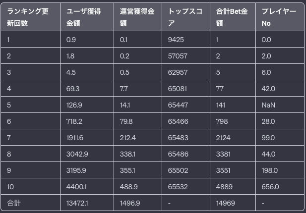

# １つのゲームの収益性シュミレート
## 条件
- プレイヤーの数: ゲームには1000人のプレイヤーが参加
- Bet額: 各プレイヤーは、ゲームに参加するたびに1円をBetしてからゲームを開始
- ランキングの更新: ゲームのランキングは、プレイヤーが以前のトップスコアを超えた場合に更新。初回のスコアは1点
- 得点の範囲: 各プレイヤーの得点は0から65536点の範囲でランダムに決定。
- 報酬の分配: ランキングが更新された場合、その時点での合計Bet金額の90%がそのプレイヤーに割り当てられ、残りの10%が運営側に割り当てられます。
- プレイの制限:
  - 各プレイヤーはランキング戦に10回挑戦して失敗するとゲームから退場（諦めてゲームを辞めていく人の再現）
  - Bet金額が100未満の場合、先頭の100人しかゲームに参加できない（ゲームの加熱はPod金額が貯まってから）
  - Bet金額が100を超えると全員がゲームに参加可能
- 終了条件: ランキングが１０回更新される。もしくは、全員がランキングを更新できなかった時
- 出力
```
- 表の横の要素
・ランキング更新時のユーザ獲得金額
・ランキング更新時の運営獲得金額
・ランキング更新したスコア
表の一番最後は合計値を出力したいです。ただし合計が意味のないものもあるので
ユーザ獲得合計金額、運営獲得合計金額、合計Bet額も出力してください
縦の要素はランキング更新されたごとに出力
```

### simulation1
